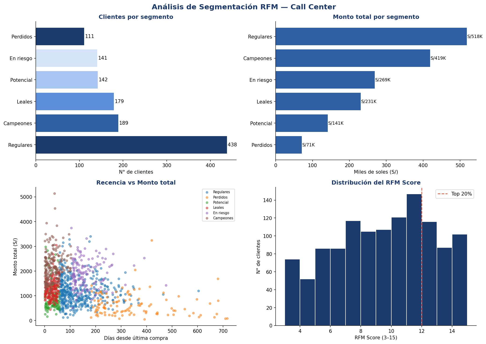

# Segmentación RFM de Clientes — Call Center

## Descripción
Solución analítica desarrollada en Python para optimizar campañas de contactabilidad en un Call Center. El modelo clasifica una cartera de +1,200 clientes usando la metodología RFM (Recencia, Frecuencia, Monto) para identificar el Top 20% más rentable y priorizarlo en el discador automático.

## Problema que resuelve
El equipo comercial realizaba el análisis de clientes de forma manual. Este script automatiza todo el proceso y genera una lista priorizada lista para cargar al discador.

## Stack tecnológico
- Python 3
- Pandas — procesamiento y agrupación de datos
- NumPy — cálculo de scores y quintiles
- Matplotlib / Seaborn — visualización

## Resultados
- 1,200 clientes analizados con 8,000 transacciones
- 6 segmentos identificados: Campeones, Leales, Potencial, Regulares, En riesgo, Perdidos
- Top 20% (240 clientes) concentra el mayor volumen de revenue
- 3 archivos exportados listos para uso operativo

## Dashboard generado


## Archivos
| Archivo | Descripción |
|---|---|
| `rfm_analisis.py` | Script principal del análisis |
| `rfm_resultados.csv` | Todos los clientes con su segmento y score |
| `top20_discador.csv` | Lista priorizada para el discador |
| `rfm_dashboard.png` | Dashboard con los 4 gráficos del análisis |

## Cómo ejecutar
```bash
pip install pandas numpy matplotlib seaborn
python rfm_analisis.py
```

## Autor
Roy Yangaly Malpartida Sanchez — Estudiante de Ingeniería de Sistemas, UCV