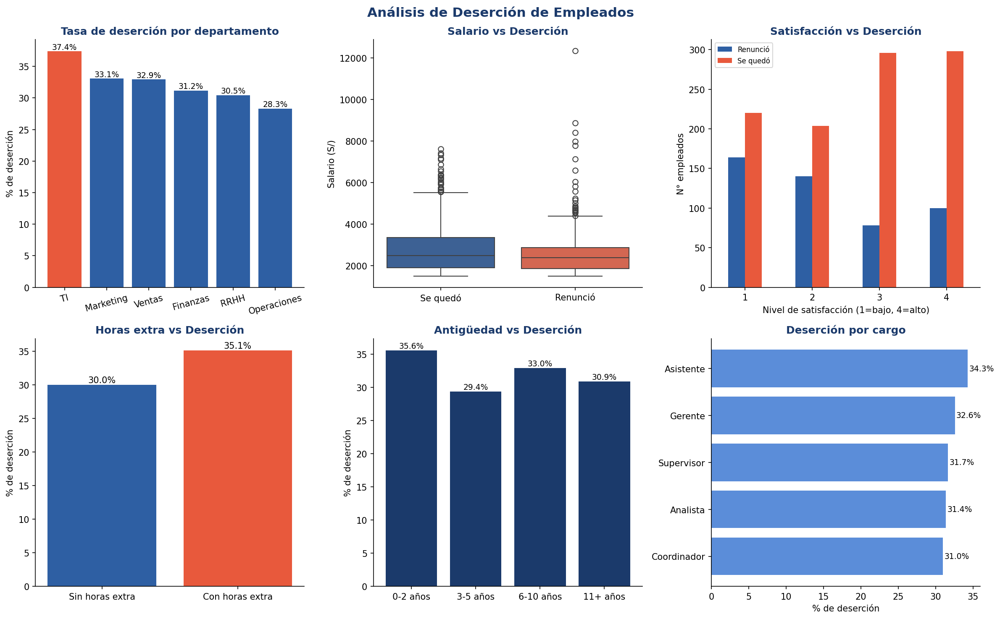

# Análisis de Deserción de Empleados

## Descripción
Análisis exploratorio desarrollado en Python para identificar los principales factores que influyen en la renuncia de empleados. El proyecto permite a los equipos de RRHH anticiparse a la deserción y tomar decisiones preventivas basadas en datos.

## Problema que resuelve
Las empresas pierden tiempo y dinero cuando un empleado renuncia inesperadamente. Este análisis identifica qué perfiles y condiciones laborales tienen mayor probabilidad de deserción para que RRHH pueda actuar antes de que ocurra.

## Stack tecnológico
- Python 3
- Pandas — procesamiento y agrupación de datos
- NumPy — generación del dataset y cálculos
- Matplotlib / Seaborn — visualización de patrones

## Hallazgos principales
- El departamento de TI tiene la mayor tasa de deserción (37.4%)
- Los empleados con bajos salarios (menos de S/3,000) renuncian más
- Empleados con 0-2 años de antigüedad son los más propensos a irse (35.6%)
- Las horas extra aumentan la deserción de 30% a 35.1%
- La satisfacción laboral baja (nivel 1-2) es el factor más crítico

## Dashboard generado


## Archivos
| Archivo | Descripción |
|---|---|
| `desercion_empleados.py` | Script principal del análisis |
| `desercion_empleados.csv` | Dataset completo con todos los empleados |
| `empleados_en_riesgo.csv` | Lista de empleados que desertaron |
| `desercion_dashboard.png` | Dashboard con los 6 gráficos del análisis |

## Cómo ejecutar
```bash
pip install pandas numpy matplotlib seaborn
python desercion_empleados.py
```

## Autor
Roy Yangaly Malpartida Sanchez — Estudiante de Ingeniería de Sistemas, UCV